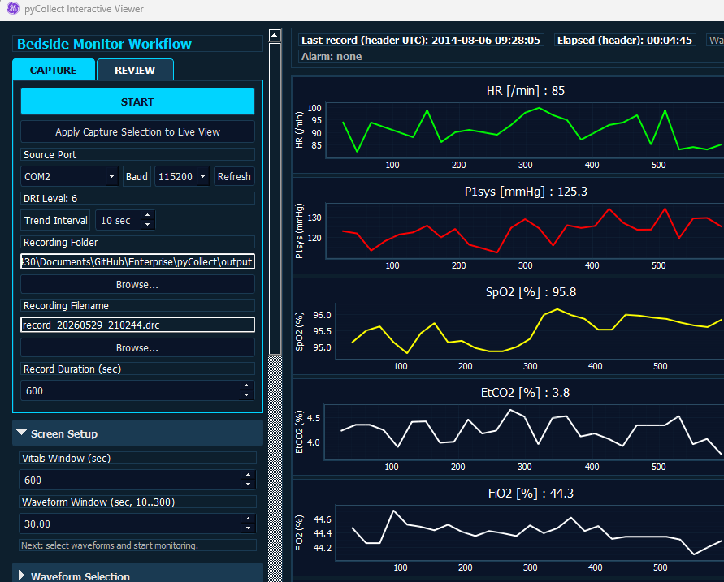
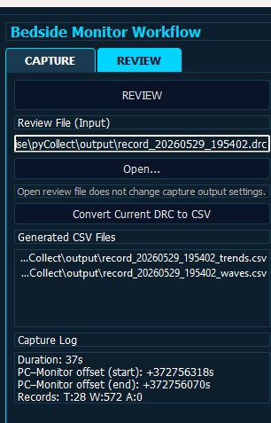
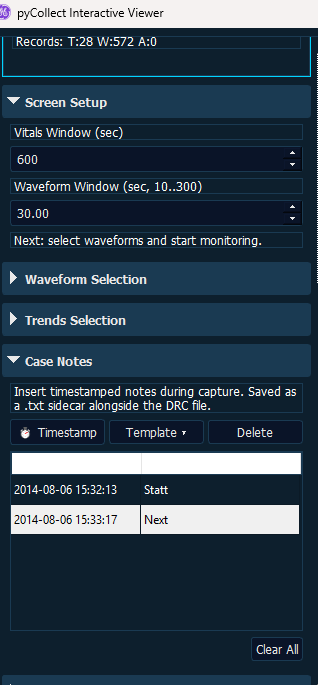

# pyCollect User Manual (GUI)

Version: 1.0  
Date: 2026-05-28  
Audience: End users operating `pyCollect.exe` (GUI only)

---

## 1. Purpose

`pyCollect` is a bedside monitor data collection and review application.

This manual covers the complete GUI workflow:

1. Install from setup executable.
2. Start the application.
3. Configure monitoring session settings.
4. Collect and save a DRC recording.
5. Convert the recording to CSV.
6. Review the recorded session in the GUI.

This document does **not** cover command-line (CLI) operation.

---

## 1a. Intended Use

pyCollect data collection software is intended to be used as a research tool for collecting data from specified GE HealthCare products. This product does not affect the intended use of these other products.

> **WARNING**
>
> This data collection software is not intended for clinical use and is not a medical device.

### Compatible GE HealthCare Devices

pyCollect is compatible with GE HealthCare patient monitors that implement the S/5 DRI (Datex Record Interface) protocol, including:

- Anesthesia Monitor AS/3, S/5
- Critical Care Monitor CS/3, S/5
- Compact Anesthesia Monitor AS/3, S/5
- Compact Critical Care Monitor CS/3, S/5
- Light Monitor
- Cardiocap/5 Monitor
- FM Monitor
- B40, B40i, B20 and B20i Monitors
- CARESCAPE Monitor B450, B650, B850
- CARESCAPE B450, B650, B850 monitors
- CARESCAPE Canvas 1000, CARESCAPE Canvas Smart Display monitors
- Patient Monitor B105M, B125M, B155M

Refer to the manual of the GE HealthCare device for instructions on how to safely connect your PC to the patient monitor.

### Safety Precautions

Refer to the GE HealthCare monitor manuals for safety precautions.

### Responsibility

GE HealthCare shall in no event be liable for any direct, indirect, incidental, special, or consequential damages caused by this product.

---

## 2. System Requirements

- Windows 10 or Windows 11
- Access to monitor serial data stream (physical monitor or validated simulator path)
- Available COM port
- User permission to install desktop applications

Recommended:

- Local write access to `%LOCALAPPDATA%\pyCollect`
- Local disk space for DRC and CSV outputs

---

## 3. Installation

### 3.1 Install Using Setup EXE

1. Locate `pyCollect_Setup.exe`.
2. Run installer.
3. Accept prompts and complete installation.
4. Optionally allow desktop/start menu shortcut creation.

### 3.2 Installed Components

The installer places application and runtime files in these locations:

- Application: `%ProgramFiles%\pyCollect` (or selected install folder)
- Runtime config and writable data seed: `%LOCALAPPDATA%\pyCollect`
- Default local output folder: `%LOCALAPPDATA%\pyCollect\output`

### 3.3 Uninstall

Uninstall from Windows Apps/Programs as usual.

Note: local runtime data under `%LOCALAPPDATA%\pyCollect` may be removed by uninstall policy.

---

## 4. Launching pyCollect (GUI)

Launch methods:

1. Desktop shortcut: `pyCollect`
2. Start menu: `pyCollect`
3. Executable: `pyCollect.exe`
4. Command line with auto-start: `pyCollect.exe --qt-gui COM5 --baud 19200 --output case123.drc`

On launch, the main window title is **pyCollect Interactive Viewer**.

When a COM port is provided on the command line, capture starts automatically with no additional user interaction required. All other settings (waveforms, trends, duration, folder) are loaded from the persisted JSON config.

Without command-line arguments, the GUI opens and the operator selects port, baud rate, and filename manually before clicking `START`.

---

## 5. Main Window Layout

The GUI is organized into a left workflow sidebar and right graph area.

### 5.1 Capture Tab

The CAPTURE tab contains all controls for configuring and running a live recording session.

### 5.2 Review Tab

The REVIEW tab provides file review, CSV conversion, and capture log summary.

### 5.3 Sidebar Sections

The sidebar uses a tabbed interface with **CAPTURE** and **REVIEW** tabs:

**CAPTURE tab:**
- `START` / `STOP` button
- `Apply Capture Selection to Live View`
- Source Port (with automatic S/5 port scan)
- Baud rate (successful source+baud combinations are highlighted green after scan)
- Refresh Ports / Scanning indicator with scan result tooltip
- Trend Interval
- Recording Folder + Browse
- Recording Filename + Browse
- Record Duration (sec)

**REVIEW tab:**
- `REVIEW` / `Exit Review` buttons
- Review File (Input) + Open browse
- `Convert Current DRC to CSV`
- Generated CSV Files list
- Capture Log summary (duration, PC–Monitor clock offset, record counts)

**Below tabs (always visible):**
- `Screen Setup` (collapsible)
  - Vitals Window (sec)
  - Waveform Window (sec)
- `Waveform Selection` (collapsible)
- `Trends Selection` (collapsible)
- `Case Notes` (collapsible)
- `Recorder Output` (status log)
- `Advanced` (lock, simulator speed)

### 5.4 Graph/Status Area

- Live trend and waveform plots
- Header with:
  - Last record timestamp
  - Elapsed header time
  - Recently active waveforms
  - Recent alarm text
- Review slider (visible in review mode)

### 5.5 Kiosk Mode (Full Screen)

Maximizing or full-screening the window (via the title bar maximize button or dragging to the top edge) automatically hides the sidebar, giving the full window area to the live graphs and alarm banner. Restoring the window to normal size brings the sidebar back.

This provides a simplified operator view during collection: the graphs, alarm status, and header information remain visible without configuration controls.

---

## 6. Quick Start (Typical Collection Session)

1. Launch `pyCollect`.
2. In `Monitor Connection`:
   - Select correct COM port.
   - Select baud rate (`19200` for many real monitor sessions, `115200` for many simulator/bridged sessions).
4. In `File Save Status`:
   - Choose Save Folder.
   - Enter Save Filename (example: `record.drc`).
4. In `Session Setup`:
   - Set Record Duration.
   - Set trend/wave display windows.
5. In `Waveform Selection` and `Trends Selection`:
   - Select desired channels.
6. Click `START`.
7. Observe live status in `Recorder Output` and plots.
8. Click `STOP` when finished (or wait for duration to complete).
9. Confirm file state indicates closed/ready.
10. Click `Convert Current DRC to CSV`.
11. Click `REVIEW` to inspect the captured recording in GUI review mode.

---

## 7. Data Collection Procedure (Detailed)

### 7.1 Configure Connection

1. Open `Monitor Connection`.
2. Click `Refresh Ports`.
3. Select active source COM port.
4. Set baud rate.
5. Optionally set Trend Interval.

### 7.2 Configure Output File

1. Open `File Save Status`.
2. Set `Save Folder` (use `Browse...` if needed).
3. Set `Save Filename`.
4. Confirm save folder and filename are correct.

Behavior note:

- If the target filename already exists, pyCollect automatically switches to a timestamped non-overwriting filename and logs this action.

### 7.3 Set Session Duration and Display Windows

1. Open `Session Setup`.
2. Set `Record Duration (sec)`.
3. Set `Vitals Window (sec)` and `Waveform Window (sec)`.

### 7.4 Select Channels

1. Open `Waveform Selection` to choose waveform channels.
2. Open `Trends Selection` to choose trend channels.
3. Use filter boxes to quickly find channels.

### 7.5 Start Recording

1. Click `START`.
2. Verify messages in `Recorder Output` such as connection and package progress.
3. Confirm plots update with incoming data.

### 7.6 Stop Recording

1. Click `STOP` (or let duration complete).
2. Wait for stop command completion and file close confirmation in log.
3. Confirm `Current DRC File` is populated and ready.

---

## 8. CSV Conversion Procedure (GUI)

After a recording is complete:

1. Go to `File Save Status`.
2. Click `Convert Current DRC to CSV`.
3. Wait for progress (% shown on button).
4. On completion, review `Saved CSV Files` list.

Expected outputs (same folder as the DRC file):

- `*_trends.csv` (always generated)
- `*_waves.csv` (generated when waveform samples are available)
- `*_pacers.csv` (generated when pacer data is available)
- `*_alarms.csv` (generated when alarm records are available)

---

## 9. Review Procedure (GUI)

Review mode replays the current recorded DRC file inside the GUI.

1. Ensure capture is not running.
2. Ensure `Current DRC File` exists.
3. Click `REVIEW`.
4. Use the review slider to move through recorded record positions.
5. Observe trend/wave plots and header timing/alarm indicators.

Review mode notes:

- `REVIEW` operates on the **current DRC file** tracked in `File Save Status`.
- Review slider appears only while review mode is active.
- Opening a review file does not change capture output settings.

---

## 10. Color/Status Behavior (Operator Reference)

### 10.1 Main Capture Button

- Blue `START`: idle/ready
- Green `START`: armed state
- Red `STOP`: recording active

### 10.2 File Save State (Current DRC File)

- Blue: appending/writing during capture
- Green: closed and ready for conversion/review

### 10.3 Waveform Selection Status (catalog colors)

In simulation-oriented sessions:

- Green: selected and receiving data
- Blue: receiving data but not selected
- Yellow: selected but waiting for data

In other sessions, delayed/missing states may display warning/alarm colors.

---

## 11. Runtime Configuration Persistence

pyCollect persists runtime settings in local config so next launch can reuse prior values.

Persisted examples include:

- Selected baud rate
- Duration/window settings
- Selected trends and waveforms
- Output folder and filename
- Section lock states

Primary runtime config location:

- `%LOCALAPPDATA%\pyCollect\pycollect_gui_config.json`

---

## 12. Logs and Output Files

### 12.1 Recording Output

- DRC file: as configured in the CAPTURE tab
- Capture log file (`.log`): saved automatically when capture closes, written alongside the DRC file

The capture log records:

- PC start and end time (local clock)
- Monitor first and last record timestamps (from DRC record headers)
- PC–Monitor clock offset
- Total record counts by type (trend, waveform, alarm)
- Recording duration

This information supports post-hoc time synchronization between the collection PC and the patient monitor, and is useful when correlating data across devices or sites.

### 12.2 Multi-Instance Operation

pyCollect supports running multiple instances simultaneously on the same PC, each connected to a different COM port. Each instance uses a unique localhost control port (starting at 9032) and discovers peer instances automatically. Start and stop commands are forwarded between instances so all collectors can be coordinated from any window.

This capability supports scenarios such as collecting from a reference device and an investigational device in parallel.

### 12.2 GUI Status Log

- Visible in `Recorder Output` panel during runtime

### 12.3 Startup Log

- `output\pycollect_qt_gui_startup.log` in application/runtime working context

---

## 13. Troubleshooting

### 13.1 No COM Ports Visible

- Click `Refresh Ports`.
- Verify cable/adapter and driver installation.
- Verify port is not already opened by another app.

The port scanner automatically probes all detected COM ports at both 19200 and 115200 baud, sending a DRI protocol request and checking for a valid response. Ports that respond are highlighted green in the dropdown; ports that do not respond are marked red. The tooltip on the Refresh Ports button shows a summary of the most recent scan results.

This significantly reduces the time spent diagnosing COM port configuration issues, which are among the most frequent problems encountered in clinical studies.

### 13.2 Cannot Start Capture

- Confirm a COM port is selected.
- Confirm output folder is writable.
- Check `Recorder Output` for specific error text.

If scanning shows green-highlighted source+baud combinations, prefer those first.

### 13.3 Flat or Missing Waveforms

- Verify correct source and baud rate.
- Check channel selection in `Waveform Selection`.
- Allow a few seconds for incoming packets and state transition.

Note: a zero-waveform capture configuration is valid; trend/alarm capture can run without waveform rows.

### 13.4 CSV Conversion Disabled

Conversion is enabled only when:

- capture has completed,
- current DRC file exists,
- conversion is not already running.

### 13.5 REVIEW Disabled

Review is enabled only when:

- capture is stopped,
- current DRC file exists and is closed.

---

## 14. Operational Notes

- Use consistent naming for each recording session (patient/case/date policy as defined by your site).
- Verify clock/timestamp consistency across systems when reviewing time-based events.
- Keep monitor source, COM mapping, and baud settings documented for repeatability.

---

## 15. Clinical Use Disclaimer

This data collection software is intended to be used as a research tool for collecting data from specified GE HealthCare products. It is **not intended for clinical use** and is **not a medical device**.

For research/engineering workflow support only unless explicitly validated and approved by your organization for clinical use.
